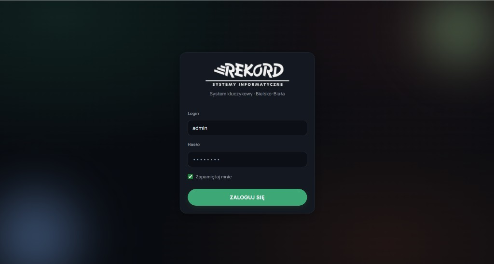
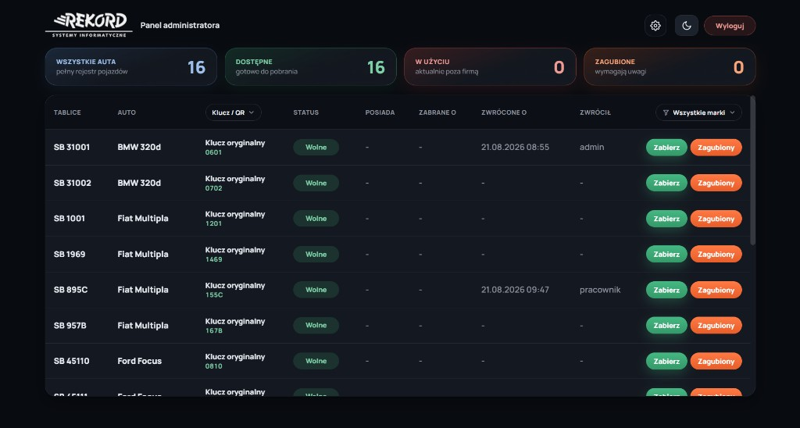
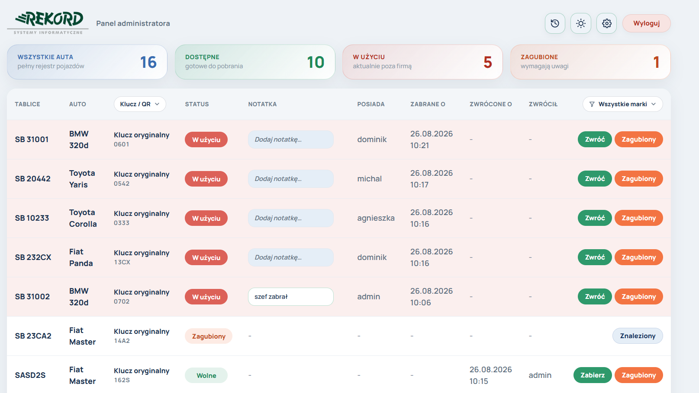
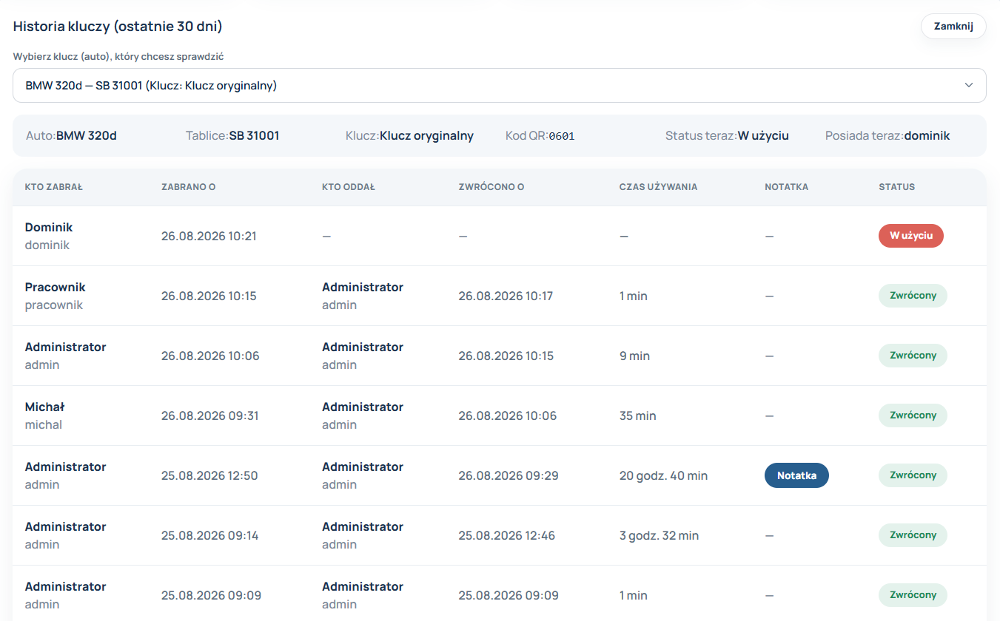
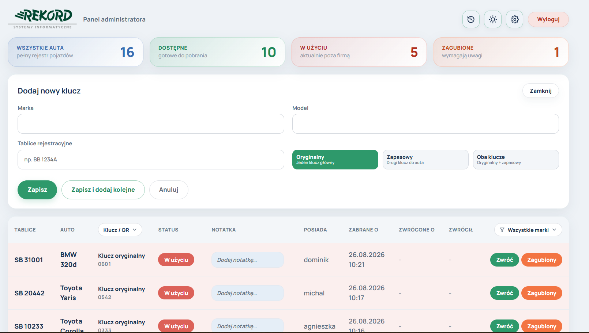
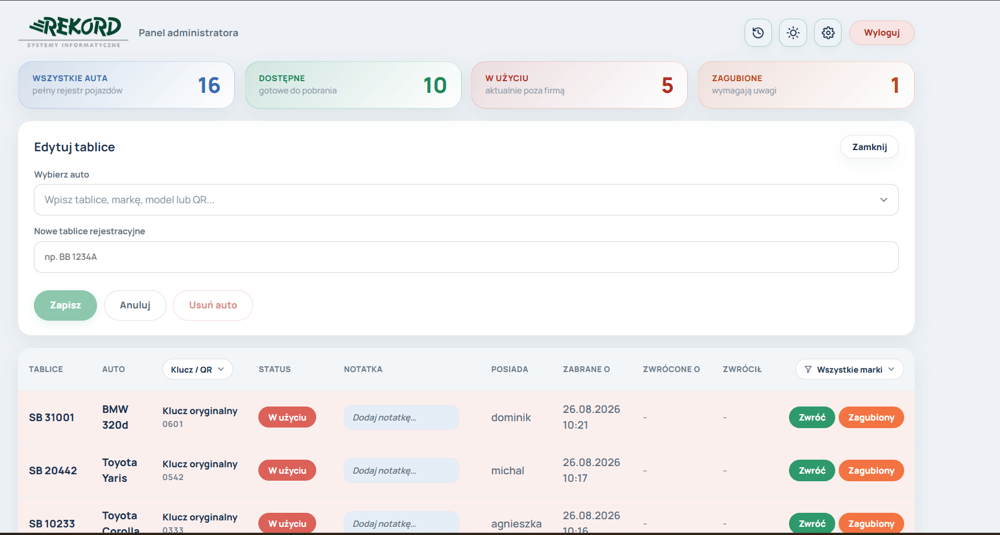
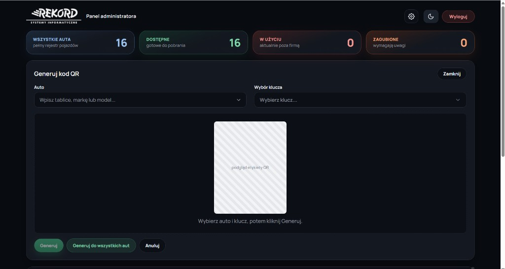
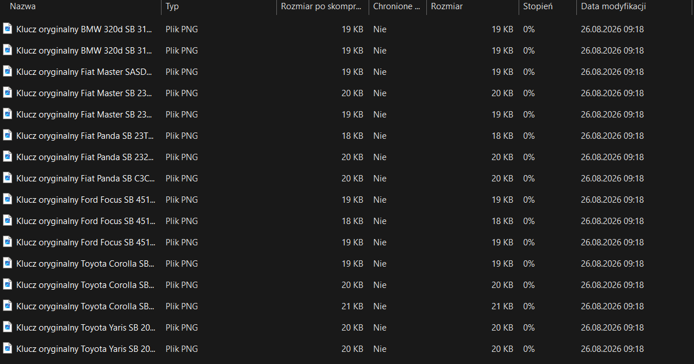
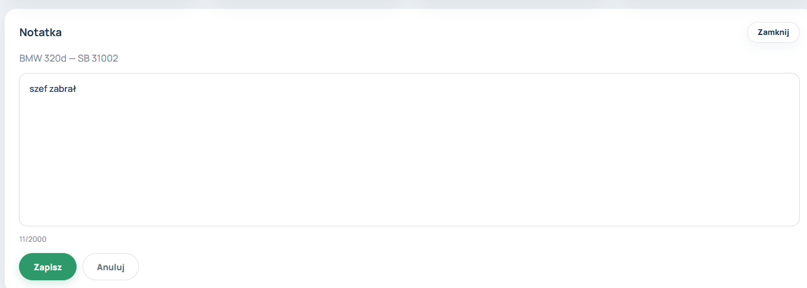
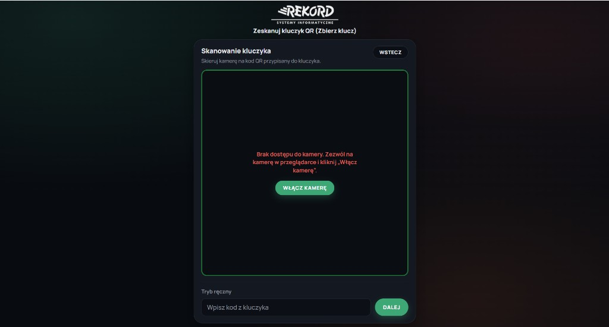

# System kluczykowy - REKORD

Aplikacja do ewidencji kluczy samochodowych firmy **REKORD Systemy Informatyczne** (Bielsko-Biała).

Umożliwia zabieranie i oddawanie kluczy (skan QR lub wpis ręczny), śledzenie statusu floty oraz kompleksowe zarządzanie rejestrami przez administratora. 
System pozwala dodatkowo na dodawanie notatek do wypożyczeń, oznaczanie kluczy jako zagubione lub odnalezione, 
a także dodawanie nowych kluczy, edycję tablic rejestracyjnych oraz generowanie kodów QR.

**Stack:** Angular (TypeScript, SCSS, HTML) • ASP.NET Core (C#) • PostgreSQL

---

## Podgląd

### Logowanie



### Panel administratora





### Historia kluczy



### Dodawanie klucza



### Edycja tablic



### Generowanie kodów QR



### Zapisywanie kodów QR



### Notatki



### Skaner (pracownik)




---

## Funkcje

- **Role:** Admin (`/admin`) i Pracownik (`/panel`)
- **Statusy kluczy:** Wolne · W użyciu · Zagubione
- **Rodzaje kluczy:** oryginalny, zapasowy albo oba naraz
- **Kody QR:** etykiety do druku (pojedynczo lub ZIP dla całej floty)
- **Historia:** kto zabrał / zwrócił klucz (ostatnie 30 dni)
- **Filtry:** marka oraz rodzaj klucza (oryginalny / zapasowy)
- **Motyw:** jasny i ciemny

---

## Konta testowe

| Login | Hasło | Rola |
| :--- | :--- | :--- |
| `admin` | `admin123` | Administrator |
| `pracownik` | `pracownik123` | Pracownik |
| `dominik` | `dominik123` | Pracownik |
| `michal` | `michal123` | Pracownik |
| `agnieszka` | `agnieszka123` | Pracownik |

---

## Uruchomienie lokalne

### 1. Baza PostgreSQL (Wymagane tylko przy pierwszym uruchomieniu na nowym komputerze)
W pgAdmin utwórz bazę o nazwie `system_kluczykowy`. 
Następnie w plikach `appsettings.json` oraz `appsettings.Development.json` (w projekcie AngularApp1.Server) podmień hasło w connection stringu na hasło do swojego lokalnego użytkownika `postgres`:
`Password=TWOJE_HASLO`

### 2. Start aplikacji

**Opcja A: Visual Studio (Zalecane - 1 kliknięcie)**
Najszybszy i najwygodniejszy sposób:
1. Otwórz rozwiązanie (`AngularApp1.slnx` lub `.sln`) w Visual Studio.
2. Upewnij się, że projekt startowy to `AngularApp1.Server`.
3. Kliknij zielony przycisk **"Play" (profil https)** na górnym pasku lub wciśnij **F5**.
*Visual Studio automatycznie uruchomi zarówno API (backend), jak i serwer Angulara (frontend).*

**Opcja B: Bez Visual Studio (Skrypty .bat)**
Jeśli używasz innego edytora kodu (np. VS Code):
1. Uruchom plik `1-URUCHOM-API.bat`
2. Uruchom plik `2-URUCHOM-FRONT.bat`
3. Otwórz przeglądarkę pod adresem `https://localhost:4200`

*Uwaga: Przy pierwszym starcie API za pomocą Entity Framework samo utworzy brakujące tabele w bazie i doda przykładowe auta.*
---

## Jak korzystać

**Pracownik**

1. Zaloguj się
2. Wybierz **Zabierz** albo **Oddaj**
3. Zeskanuj kod QR od razu za pomocą aparatu w urządzeniu (np. w telefonie) albo wpisz go ręcznie
4. Potwierdź operację

**Administrator**

- przegląda rejestr i statusy floty
- dodaje / edytuje klucze
- generuje etykiety QR (także ZIP dla wszystkich aut)
- oznacza klucze jako zagubione / znalezione
- sprawdza historię wypożyczeń

---

## Format kodu QR

Kod ma postać: **slot + 2 ostatnie litery/cyfry rejestracji**  
Przykład: tablice `SB 895C`, slot `15` → `155C`

Numery wewnętrzne kluczy: `K-O-XX` (oryginalny), `K-Z-XX` (zapasowy).

---

## Telefon w sieci Wi-Fi

1. Na PC: `ipconfig` → zapisz adres IP
2. Na telefonie (to samo Wi-Fi): `https://TWOJE_IP:4200`
3. Zaakceptuj certyfikat developerski w przeglądarce

---

## Wdrożenie na serwer

Na serwerze **nie** uruchamiaj `npm start` — to tryb developerski.

```bash
cd AngularApp1.Server
dotnet publish -c Release -o ./publish
```

Ustaw połączenie z PostgreSQL w `publish/appsettings.Production.json`, potem:

```bash
cd publish
set ASPNETCORE_ENVIRONMENT=Production
dotnet AngularApp1.Server.dll --urls "http://0.0.0.0:5000"
```

Wejdź na adres API, np. `http://IP_SERWERA:5000/login`.

Bez HTTPS dodaj w produkcji: `"UseHttpsRedirection": false`.

---

## Gdy coś nie działa

- **Błąd bazy** — sprawdź hasło i czy istnieje baza `system_kluczykowy`
- **Logowanie nie działa** — otwórz `/api/cars` (401 = API działa; 404 = zły adres)
- **Strona lokalnie** — zawsze **https://localhost:4200**, nie port API
